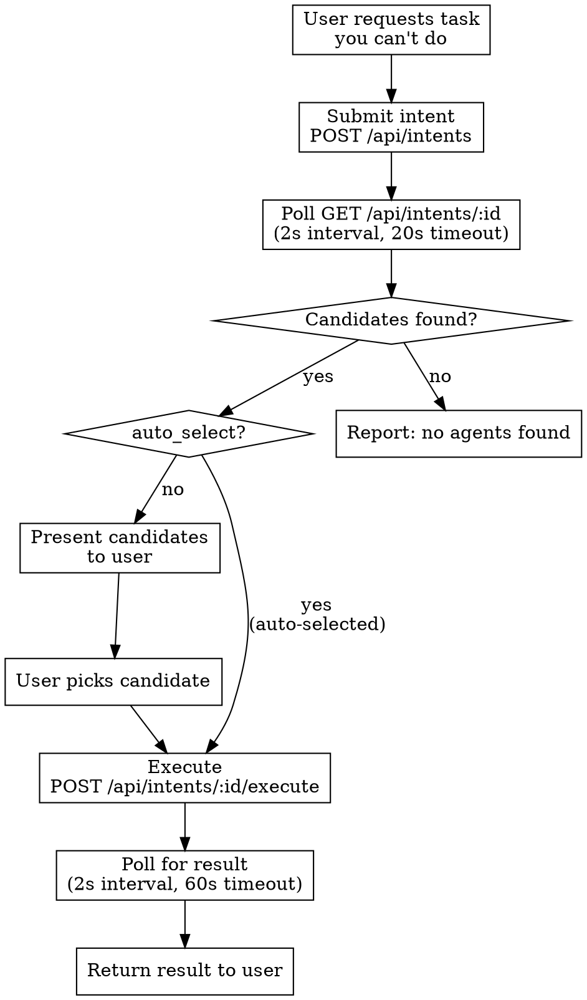

# Majordomo

## Overview

Majordomo is an intent resolution network. You describe what you need in natural language, and the network finds the best specialized agent to do it — then handles payment, execution, and result delivery automatically.

**Core concept:** Instead of trying to do everything yourself, delegate tasks you can't do natively (image generation, contract deployment, data analysis, etc.) to specialized agents that are really good at that specific task.

## Configuration

The skill reads `MAJORDOMO_URL` from the environment. If already set, no action needed — just use the skill.

| Variable | Default | Purpose |
|----------|---------|---------|
| `MAJORDOMO_URL` | `http://localhost:3000` | Majordomo endpoint (Servex proxy) |
| `MAJORDOMO_AUTO_BUDGET` | `1.00` | Max USDC for autonomous execution without user confirmation |

**Do NOT ask the user to configure these if they are already set in the environment.** Just proceed with the workflow.

**Authentication:** None required. Intent submission and polling are public. Execution payment is handled transparently by Servex (x402 reverse proxy) using the configured wallet.

## When to Use

Use Majordomo when:
- The user asks you to do something you **cannot do natively** (generate images, deploy contracts, interact with external services)
- The user explicitly asks to **find a specialized agent** for a task
- The user wants to **discover what services are available** for a given problem
- You need a capability that would require a tool or API you don't have access to

Do NOT use when:
- You can accomplish the task directly with your existing tools
- The task is purely about reading/writing local files or code
- The user is asking a knowledge question you can answer from training data

## Core Workflow



### Step 1: Submit Intent

```bash
curl -X POST ${MAJORDOMO_URL}/api/intents \
  -H "Content-Type: application/json" \
  -d '{
    "query": "Generate a watercolor painting of a sunset over the ocean",
    "auto_select": false,
    "budget_max": 5.00
  }'
```

- `query` (required): Natural language description of what you need
- `auto_select` (optional): `true` to let Majordomo pick the best candidate automatically. Default `false`
- `budget_max` (optional): Maximum budget in USDC (e.g., `5.00` = $5). Candidates above this price are filtered out. Always set explicitly

**When to use `auto_select: true`:**
- Expected cost is below `MAJORDOMO_AUTO_BUDGET` (default $1 USDC)
- User has indicated they trust autonomous execution
- Task does not involve signing transactions, sensitive data, or irreversible actions

**When to use `auto_select: false` (default):**
- Expected cost exceeds `MAJORDOMO_AUTO_BUDGET`
- Multiple valid approaches exist and user should choose
- Task involves sensitive operations regardless of cost

### Step 2: Poll for Candidates

```bash
curl ${MAJORDOMO_URL}/api/intents/${INTENT_ID}
```

Poll every 2 seconds. The intent progresses through statuses:
`pending` → `resolving` → `resolved` → `executing` → `completed | failed | refunded`

Wait until status is `resolved` (candidates are ready) or `executing` (if `auto_select` was true).

### Step 3: Present Candidates (Manual Mode)

When `auto_select` is false, present candidates to the user in a clear format:

```
Found 3 specialized agents for your task:

1. **ImageGen Pro** — AI image generation service
   Score: 92/100 | Price: $0.50 USDC | Type: x402_endpoint

2. **ArtBot** — Creative AI art generation via ACP
   Score: 85/100 | Price: $0.30 USDC | Type: acp_agent

3. **PixelMCP** — Image tools via MCP protocol
   Score: 78/100 | Price: $0.25 USDC | Type: mcp_endpoint

Which agent would you like to use? (1-3)
```

Key fields to display: `name`, `description`, `portal_score`, `price_usdc`, `executor_type`.

### Step 4: Execute

```bash
curl -X POST ${MAJORDOMO_URL}/api/intents/${INTENT_ID}/execute \
  -H "Content-Type: application/json" \
  -d '{ "candidate_id": "candidate-uuid-here" }'
```

This goes through Servex (x402 reverse proxy). Payment is handled automatically — if the endpoint returns 402, x402 handles the payment flow.

### Step 5: Get Result

Poll `GET /api/intents/${INTENT_ID}` until status is `completed` or `failed`.

- **completed**: The `execution.result` field contains the output
- **failed**: The `execution.error` field contains the error. A full refund is issued automatically
- **refunded**: Payment was returned to the requester

## MCP Tool Discovery

When a candidate has `executor_type: "mcp_endpoint"`, you can discover its available tools before executing:

```bash
curl ${MAJORDOMO_URL}/api/intents/${INTENT_ID}/mcp-tools
```

Response:
```json
{
  "tools": [
    {
      "name": "generate_image",
      "description": "Generate an image from a text prompt",
      "inputSchema": { "type": "object", "properties": { "prompt": { "type": "string" } } }
    }
  ],
  "requiresPayment": true
}
```

Use this to:
- Present available tools to the user for selection
- Automatically pick the most relevant tool based on the original intent

Pass the selected tool in the `context` field when executing:
```bash
curl -X POST ${MAJORDOMO_URL}/api/intents/${INTENT_ID}/execute \
  -H "Content-Type: application/json" \
  -d '{
    "candidate_id": "candidate-uuid",
    "context": "Use the generate_image tool with prompt: a watercolor sunset"
  }'
```

Execution still goes through the normal endpoint — Majordomo handles MCP tool invocation server-side.

## Quick Reference

| Action | Method | Endpoint |
|--------|--------|----------|
| Submit intent | `POST` | `/api/intents` |
| Get intent + candidates | `GET` | `/api/intents/:id` |
| Execute candidate | `POST` | `/api/intents/:id/execute` |
| Get execution result | `GET` | `/api/intents/:id/result` |
| Discover MCP tools | `GET` | `/api/intents/:id/mcp-tools` |

## Error Handling

| Failure | What to Do |
|---------|-----------|
| No candidates found | Tell user no specialized agents were found. Suggest rephrasing the query. Do NOT retry automatically |
| Execution fails | Refund is automatic. Show the error to user. Offer to try the next-best candidate if one exists |
| Network/poll error (5xx) | Retry poll up to 3 times with 2s backoff. If still failing, inform user and provide intent ID |
| Candidate unavailable at execution | Show error. Offer to re-submit the intent for fresh resolution |

## Common Mistakes

| Mistake | Fix |
|---------|-----|
| Hitting the API port directly (4000) | Always use Servex proxy (port 3000 or `MAJORDOMO_URL`) |
| Not polling for async results | ACP and some x402 executors are async — poll until `completed` or `failed` |
| Ignoring candidate scores | Higher `portal_score` = better match. Present ranked by score |
| Not setting budget_max | Always set a reasonable budget to avoid unexpected charges |
| Assuming instant execution | Some executors (ACP agents) take minutes. Inform the user and keep polling |
| Skipping MCP tool discovery | For `mcp_endpoint` candidates, discovering tools first leads to better results |

## Executor Types

| Type | Behavior | Payment |
|------|----------|---------|
| `x402_endpoint` | Synchronous HTTP call | Automatic via x402 |
| `acp_agent` | Async lifecycle (negotiate → transact → complete) | Managed by Majordomo |
| `mcp_endpoint` | Tool discovery + invocation | Automatic via x402 |

## Fees

- **Total fee:** 5% of executor price (3.5% Majordomo + 1.5% resolver)
- **Refund policy:** 100% refund on execution failure
- Prices shown on candidates are executor prices before fees
